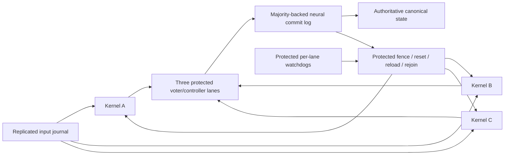

# Stage D: mask stalled tick replicas, then restore redundancy

This is a specification and reliability model, not a netlist implementation or a
Stage D pass. Replicate the **whole resident tick kernel three times per logical
control-node service**, vote complete canonical states, commit through a protected
replicated neural log, and repair a stalled replica from that log. Voting alone
leaves failed replicas unavailable: at the observed stall rate, unrepaired TMR
still has about **50% campaign failure probability** over 100 logical copies ×
1,000 ticks. **0.2245426% is an ideal floor at h=5e-5, R=2, f_repair=0,
controller-lane hazard=0, writer hazard=0, alpha=0 (purely transaction-driven
exposure), homogeneous replicas and perfect
timers/protection; it is not a forecast.** At the same hazard, f_repair=1%
raises failure to **0.9430644%**, and f_repair=10% to **7.1533518%**.
With no qualified repair (f_repair=1), it is **49.9825019%** before controller
or writer failures. The sensitivity table below varies these assumptions,
cadence and persistent frailty. Recovery feasibility is the first build gate.

Sources are [the plan](plan.md), [Stage D harness](stage_d.md), the
[performance ledger](perf_campaign.md), and the updated
[datapath](stage_d_datapath_stall.md), [request](stage_d_request_stall.md), and
[completion](stage_d_completion_stall.md) stall reports, and
[stable-latch qualification frontier](stable_latch.md). The latter finds that
none of its evaluated combinations meets all six requirements: the experimental
autapse improves clear counts but fails the independent-corner rate floor and
reload-margin gates. This is an inspected finite qualification frontier, not a
proof that every possible latch design is impossible. These reports rule out
treating a stronger clear or a timed READY as a generally qualified cure.
No improvement from combining `zero_once`, `robust_request_clear`, and
`experimental_register_reset` is assumed here. A new campaign must retain its
flags, counts and exposure before its result can replace the historical hazard.

## 1. What the plan requires, and what runs on the host

The exact Stage D wording in `docs/plan.md` is:

> `minidoom` `p_*` on control nodes with TMR + commit log.
>
> Exit: 1,000 ticks of scripted and fresh random input, canonical state equal to the
> reference every tick; a retried commit is applied once.

The plan does **not** put “100 copies, mix B, zero faults/timeouts” in that sentence.
Those are the current noisy qualification campaign and the stricter scoring rules
in `docs/stage_d.md`. Nor does a `tick2.c` pass demonstrate `minidoom p_*`: the
current program has only three 8-bit architectural words. Its nominal 1,000-tick
pass in the ledger supersedes the older “not run yet” header in `stage_d.md`.

The plan's opening host inventory permits only neuron integration, spike
transport, input transduction, **initial** program-image loading, and display of
already-computed pixels. Game arithmetic, collision, branches, state evolution,
and rasterization remain neural. The reference and IR interpreter are test-only
observers, never a source of replacement runtime state.

There is also an explicit staged exception: Python control plane in Stages C–F,
labeled **hybrid**; F2 replaces readiness, dispatch, commit decision and
application recovery with neural control. That permits an identified temporary
hybrid orchestration implementation; it does not expand permission to compute
the game on the host. A Python decoded-state voter, Python commit log, host
timeout/restart decision, or host-computed checkpoint-to-spike loader would be
such external orchestration. Each exceeds the literal five-operation inventory,
must be disclosed, and cannot be presented as a neural protected voter or a
transport-only host. The primary design uses neural vote, watchdog, log, apply
and recovery. Section 5 also costs a **hybrid C–F alternative**, using neural
comparison, log storage, state application and transfer with Python timing,
identity counters, fencing and recovery sequencing. Both remain design
candidates; neither claims F2.

FlyLink must remain a conduit:

| Field/action | Runtime origin in the plan and this design |
|---|---|
| Physical source neuron ID, simulator timestamp, physical route | External transport |
| Destination/multicast group, port, epoch, sequence, flags, payload | Neural sender's port codec, represented by tokens |
| Transport checksum | External transport; packet corruption only |
| Logical request ID, tick, comparison, quorum, timeout, retransmit, checkpoint selection | Neural circuits |

The fourth row is this all-neural design's addition; the plan's FlyLink inventory
specifies the first three. The hybrid variant declares its Python decisions
separately and does not attribute them to the transport or neural sender.

The host may deliver a checkpoint's already-generated rail events using a fixed
mapping. It may not decode a majority, synthesize those rails from Python game
objects, generate logical ACK/epoch fields, or set membrane/current/latch arrays
to recover a replica. `cluster/flylink.py` currently transports address events
over a fixed mapping. [Stage C](stage_c_flylink.md) demonstrates an alternating-bit
channel, but full epochs, reordering/corruption recovery, and the final field
codec remain work. A transport checksum does not detect a neural wrong value.

## 2. Replication and the commit boundary

One logical service (all decision and storage boxes are neural):



### Replicate a complete failure domain

Each logical service has lanes A/B/C, each containing the tick datapath, feedback
state, request/clear/completion machinery, local input storage, and local output
assembly. Use independent static weight/threshold/bias draws and independent stray
streams, and diverse placements as the plan requires. Do not fan out one sampled
noise mask or share mutable rails/reset circuitry among the three lanes. Shared
read-only topology in the simulator does not imply shared neuronal state.

This is **not per-cell voting**. A cell-level join that waits for all three can
still deadlock; a voter at every cell adds another reset/completion failure path
at every boundary and cannot recover distributed partial transactions by itself.
Whole-kernel replication confines those failures behind one transactional fence.
Three regions within a simulated node suffice for an initial independent-noise
experiment, but not for Stage F node-kill tolerance. For F, place lanes and log
members across distinct kill domains; one GPU/process hosting all three is one
common failure domain. “100 copies” in the proposed campaign means **100 TMR
services, hence 300 kernel lanes**, plus protection circuits, not 100/3 services.

### Vote a complete, tagged candidate state

For `stage-d-canonical-v1`, the canonical payload is exactly `px, mx, health`,
three unsigned bytes, in that order, no padding. Preserve the defined widths,
endianness, and overflow semantics. For `minidoom`, extend the architectural
schema to all persistent objects, registers, RNG state and continuation state;
renderers consume only a committed version.

The first implementation allows **one outstanding logical tick**. A replicated
neural input journal captures a transduced input once, assigns `(run_epoch,
stream, tick)` and retains it through commit. Dispatch gives all eligible lanes
the same input and the same committed predecessor. A lane emits a proposal only
after all canonical fields have a fresh, valid, exclusive dual-rail word for
that tick. Its ordinary cell “commit pulse” is not that certificate: the
completion report shows commands followed by no completed master rewrite.

Each voter lane buffers three proposals and compares **all state words and
their identity fields**. Compare A/B, A/C, B/C; authorize a pair only if the
same pair agrees on the entire vector, input identity, epoch, tick, and schema.
Choose a deterministic agreeing pair (e.g. AB, then AC, then BC) and copy its
buffered vector. Do not construct a state by choosing different pairs for
different words: that could create a state no two executions produced. A hash
alone is not an exact comparison. Silence, a partial word, both rails, wrong
generation, or a mismatched tick is ineligible, never a zero or an implicit vote.

Two agreeing complete proposals may commit immediately; the missing third need
not reach its deadline. A missing or disagreeing third is contained. With no
agreeing pair, **stop committing** and report a bounded service failure; never
pick the fastest lane, interpolate state, or ask the reference to supply it.
The two good lanes continue only from the voted predecessor. Initially this
means a neural input/feedback barrier after commit; the current unpaced,
overlapping tick pipeline must not be wrapped without that barrier. A later
pipelined version needs per-tick speculative buffers and an explicit rollback
contract and a new hazard/latency measurement.

**Proposal followed by a wedged master rewrite:** a complete buffered proposal
may still contribute to this tick's quorum even if its producer subsequently
stalls. Eligibility for START k+1 requires a separate local-rearm certificate:
all architectural masters read back equal to the certified C[k], Q/M completion
and actual READY/IDLE interlocks agree, and the incarnation remains current.
Healthy lanes use this checked local feedback, not a per-tick log reload.
Local readback runs concurrently with append/publication; dispatch waits for
two rearmed lanes. A proposal alone never cancels the rearm watchdog. A wedged
lane is fenced and takes the full log reload path in section 3. If readback adds
critical-path time, remeasure cadence and R; the budget is not a free reload.

### Protected voter and majority-backed log

Use three independently placed voter/controller/log lanes. Each has its own
receive buffers, exact comparators, protocol state, and storage. Consumers accept
only a same-identity, same-payload certificate from two controller lanes. Keep
the final certificate qualifier, fencing, epoch checks and log readers inside
the declared **protected** boundary. Replicating a voter does not remove the
final selection/qualification problem. Its residual failure rate, including
shared inputs, fan-out and controller faults, is a model parameter, not zero by
construction. An unprotected Python `majority()` is not its implementation.

The initial all-neural prototype has a **static single writer and no qualified
writer repair or replacement path**. It is a service-liveness single point of
failure, even when its corruption is fail-stop. `writer_hazard` counts its stall
as a failed campaign; zero is only the ideal floor assumption. Every log member
checks the previous committed index,
request identity and payload, writes a complete inactive record, then emits a
neural durable-within-the-declared-crash-model ACK. A commit certificate requires
two matching stored records. Publish `(state, last_applied_tick, request_id)` as
one versioned architectural record; readers qualify the whole version, never
partially updated words. Keep the previous bank live until the new record has
a certificate. The replicated last-applied record is the application marker,
so no crash window can advance a tick counter separately from its state.

“Apply” is installing that voted state version, not invoking the world update
again. A repeated `(epoch, stream, tick)` with identical payload returns the
existing ACK/certificate; it does not advance `last_applied`, update health,
consume input, or emit another logical state notification. Same identity with a
different payload is a conflict and fail-stop. Old identities are rejected by
the persisted watermark even after log compaction. A future tick cannot jump
a gap. Keep the current request's full payload until its retry window closes;
ancient retries get an already-applied/stale response, not a new append.

Two alternating committed-state banks plus the in-flight entry suffice for the
serialized toy kernel, provided compaction retains request identity, applied
watermark, and quorum evidence. This is a checkpointed bounded commit log, not
an unbounded audit history. Retaining 1,000 complete entries neurally has a
separate linear capacity cost. An observer may archive them for testing, but
that archive is not authoritative runtime storage. On controller/node restart,
neural peer agreement chooses the highest certified committed prefix, reconciles
an interrupted append, and fences obsolete writers before accepting new work.
“Raft-shaped” in the plan is not a substitute for proving these rules. If a
static writer dies, bounded fail-stop preserves safety **and fails D liveness**.
F requires protected replacement-writer selection as well.

**Log member wedged mid-append:** the append watch runs on every request, not
only after a restart. A member ACKs only a fully written and read-back record.
Timeout fences that member/incarnation and discards its uncertified inactive
bank; the previous certified bank stays live. Two matching member ACKs can
commit without the third; late ACKs from the fenced generation cannot publish.
The controller/log lane stays unavailable thereafter in this prototype. Loss
of a second member stops commits. Resetting/rebuilding a member from the two
remaining certified peers is a possible extension, but it has **no qualified
repair path here** and receives no availability credit in the model.

Voter buffers, comparators, input journal and log banks share each controller
lane's failure domain. Their raw stall probability is `controller_hazard`;
unrepaired 2-of-3 controller availability is explicitly modeled separately from
kernel repair. Residual wrong certificates/final qualifier defects remain in
`voter_failure`. The two terms must not count the same event twice. A small raw
controller hazard is not justified by triplication: these lanes contain the
same unqualified storage primitives. The hybrid alternative reduces neural
sequencing hazards but retains neural comparator/log-member exposure.

## 3. Neural stall detection, masking, and recovery

Arm a per-lane timer on accepted `START(epoch,tick)`, outside that lane's reset
domain. Cancel it only on the matching complete proposal **and local-rearm**
certificate, not a heartbeat, a rail train, or activity on a previous tick.
Use three independently protected timer channels per lane and a two-of-three
timeout authorization. Timer cancellation and reset must be tagged and finish
before reuse. A delayed t ACK must not cancel t+1's watch. A false timeout is a
lane outage; correlated or unsafe fencing is a protection failure.

Choose a bound from a measured worst-case valid response over the declared
input/noise/link envelope, including boot latency, backpressure and retries.
The current host `--stall-ticks` diagnostic is not a neural watchdog contract.
For budgeting only, a 4,000-hop existing-style timer is about **21.2 neural s**
(5.3 ms/hop). This exceeds the nominal 12.1-s first full-state result, but is
**not a qualified worst-case deadline**. Distinguish a replica deadline from the
service deadline: timely two-lane commits remain successful while one timer
expires. State buffers must retain valid words throughout the longest allowed
vote/retry/repair interval; qualify retention, do not assume it is infinite.

The kernel watch covers a lane's complete local tick proposal. A separate
protected append/apply watch covers the service's authoritative commit: receiving
three proposals must not hide a stalled log or publication path. Likewise, arm
a recovery deadline outside the failed lane. These shorter controller timers
and their failure terms belong to the protected control budget below.

The recovery state machine is:

1. **Fence.** On a protected timeout or invalid/disagreeing proposal, revoke that
   lane's vote/output/input credits and advance its neural incarnation token.
   Ignore any delayed proposal from the old incarnation. Fencing precedes reset.
2. **Quiesce.** Inhibit START, COPY, feedback and port emission. Drain delayed
   events under the model's ≤10-ms synaptic-delay bound plus measured relay and
   synaptic-current settling. Interrupting a cell alone is insufficient: its
   producers, repair chains or delayed re-lights can revive it.
3. **Reset the replica.** Use a dedicated neural reset sequencer over the full
   transient domain: Q and M rails, validity/completion trees, ALU state, request
   pairs, IDLE/ACT/COMMIT/grant/COPY, pending port words, flag generators and rate
   readers. Check both latch members and all extended reset targets. Suppress
   all producers until reset, recovery and load finish. Do not equate a timed
   READY with actual emptiness. A quiet interval is evidence under a qualified
   envelope, not proof for arbitrary noise or residual hyperpolarization.
4. **Choose an architectural boundary.** The two healthy lanes may run while
   reset proceeds. At a certified committed tick k, hold dispatch at a neural
   barrier and pin state C[k] until reload completes. For a simpler first
   prototype, hold this barrier throughout repair. If the lane fell behind by
   many ticks, choose the latest certified checkpoint; do not chase a moving
   state by replaying world updates. The input journal retains the next input.
5. **Reload neurally.** The log's dual-rail storage drives a selected-rail copy
   path through the lane's validated write ports into architectural feedback
   masters. Every bit emits rail 0 or rail 1 explicitly. A neural sequencer
   restores addresses/words, tick and last-applied identity, the safe continuation
   (“before START k+1”), and defined flags/control readiness. Transient scratch
   is empty or initialized before read; constants cleared by quiescence are
   reloaded from the neural ROM/image already installed at startup. No host
   decoding, `load_pipeline_image` call with a Python state dict, direct state
   array write, or saved membrane snapshot is involved.
6. **Verify and rejoin.** Wait for fresh completion and actual ready interlocks,
   read back the canonical state/continuation through neural comparators against
   the pinned checkpoint, and require a protected same-version join certificate.
   Release the dispatch barrier for k+1. The existing kernel's Q READY is not
   consumed by IDLE; that interlock must be added before a reset retry is safe.
   A partial load, survivor, timeout, wrong tag or bad readback leaves the lane
   fenced; it must never vote just because a timer elapsed.

**Wedged reload consumer:** each consumer has a private validated transfer
buffer and one-way selected-rail fan-out. Copy the pinned certified checkpoint
into that buffer before engaging the consumer. Consumer ACK, READY, reset and
backpressure have no path into authoritative bank storage/reset/read enable or
other consumers' ports. The external recovery deadline expires independently;
fence the consumer, discard its transfer buffer, and release the global dispatch
barrier for the healthy pair. It cannot keep the log pinned indefinitely.
Inject a permanently dark READY, both rails, continuous consumer firing and
never-ACK at each word; require unchanged bank readback and healthy commits.
Failure of this isolation is service-fatal protection failure, not safe
f_repair. The buffer/fence fan-out has an explicit budget in section 5.

Bound the attempts and total recovery deadline. Exhaustion leaves a permanently
unavailable lane and is reported separately; it is not a successful repair.
A qualified cold spare could replace it, but needs additional capacity and its
own neural load/join path. Two unavailable lanes stop commits. A policy that
tries to recover after losing the majority would need an additional recovery
deadline/state model; the quantitative model below conservatively counts that
event as an exit failure immediately.

The existing reset-verification prototype is **not** a drop-in recovery path:
the completion report records exhaustion, a combined-domain failure before
reset, and a Q retry clearing an already-started next transaction. Likewise
`experimental_register_reset` has known full-domain failures. TMR changes their
system consequence only if fencing and recovery really restore redundancy.
It cannot make a permanently bad lane healthy by definition. Static perturbations
remain the same after reset; resetting is not a fresh noise draw.

For Stage F, recovery starts with surviving neural log/checkpoint replicas;
the host may launch/integrate a replacement image, but its architectural state
arrives from neural peers. Committed ticks are restored as state records, never
re-evaluated by F. An uncommitted tick may be recomputed from C[k] and the retained
input after fencing its old proposals. TMR already evaluates F redundantly;
“no repeated world update” means no repeated **authoritative application** of a
committed tick. Drop an ACK after apply, restart, and retry: application remains
once. Simulator snapshots of voltages/currents/delay queues serve debugging/HPC
resume only and do not establish this recovery claim. Loss of every log majority
stops the service; live recurrent storage is not nonvolatile persistence across
loss of all neural nodes.

## 4. Quantitative reliability model

Implementation: [tmr_model.py](../drosophilos/bench/tmr_model.py), pure Python/NumPy.
It neither imports game code nor controls the simulator. `Model`, `analytic`,
`monte_carlo`, `binned_hazard`, `cadence_hazard`, `first_stall_estimate`,
`sensitivity_table`, and `unreplicated_failure` are usable directly.

### Evidence and temporal distribution

Use h=5e-5 as an illustrative **old-cadence** point, not a fitted TMR hazard.
Treat each observation as a right-censored first-stall mission. The specifically
documented head-to-head runs give:

| Build | Completed ticks before first stalled attempt | Fully matched copies |
|---|---|---:|
| Default | 1, 31, 323, 728 | 96/100 |
| `rate_robust` | 450, 535, 599, 654, 864 | 95/100 |

The numbers are completed-tick counts: a stop after one completed tick is model
index 1, the second attempted tick. There are both early and late events; a
startup burn-in cannot establish long-run liveness. Total attempted exposure is
97,083 + 4 + 98,102 + 5 = **195,194 replica-ticks**, giving 9/195,194 ≈ 4.61×10⁻⁵.
The ledger also reports a batch fault in each run; “zero wrong” does not mean
“zero detected internal faults.” The older nine-stall build is not pooled here.

The review request also reports six-stall campaigns, including **zero_once
6/100**; their exact event times are not supplied in these reports, so use the
mission fraction rather than inventing attempted exposure. For independent
copies of a fixed build, `first_stall_estimate` maps a binomial Wilson 95%
interval for first-stall fraction p to constant hazard `h=1-(1-p)^(1/1000)`:

| Campaign tally (100 copies × 1,000 ticks) | First-stall fraction, Wilson 95% CI | Equivalent old-cadence h, 95% CI |
|---|---|---|
| Default 4/100 | 4%; 1.5663–9.8371% | 4.08212e-5; 1.57871e-5–1.03546e-4 |
| Rate-robust 5/100 | 5%; 2.1544–11.1750% | 5.12920e-5; 2.17789e-5–1.18496e-4 |
| Reported six-stall / zero_once 6/100 | 6%; 2.7786–12.4768% | 6.18735e-5; 2.81791e-5–1.33258e-4 |
| Historical old build 9/100 (separate cohort) | 9%; 4.8073–16.2262% | 9.43062e-5; 4.92652e-5–1.77034e-4 |

These intervals describe copy sampling only, under the stated independence and
constant-h assumptions. Same-seed/different-build observations are not pooled
as independent cohorts. Static frailty can violate constant-h; the interval is
not confidence in the floor. Unknown stall times in the six-stall runs do not
justify pooling them with the nine known events. Even 4–6/100 permits a much
wider hazard range than 4–6e-5.

**Cadence exposure:** the source steady interval is 5.84 neural seconds (about
5.8), whereas the proposed serialized schedule is about 13 s. Let alpha be the
fraction of cumulative hazard driven by elapsed neural time rather than tick
transactions. `cadence_hazard` uses
`h_new=1-(1-h_old)^((1-alpha)+alpha*13/5.84)`.
At h_old=5e-5, alpha=0/0.5/1 gives h_new=5e-5/8.0649449e-5/1.1129796e-4.
The fully time-driven R=2 result is **1.1073261%**, not 0.2245%; at R=3 it is
about 1.84%. Apply the same transform to the confidence endpoints. The upper
6/100 endpoint becomes about 2.97e-4, so the table spans **1.5e-5–3e-4** at the
TMR cadence (and records 9/100 separately). Holds, reset pauses and additional
counter/reload delays count as elapsed exposure. Alpha and the actual cadence
remain unmeasured; scaling per-tick exposure is an assumption to qualify, not
evidence of a measured improvement.

The timing sensitivity pools the nine events into four bins. Pooling two builds
with the same seed is illustrative, not nine independent measurements of one
fixed circuit. Bin rates are first stalls divided by at-risk attempted ticks:

| Zero-based attempt indices | Events | Exposure | Raw h | h normalized to the constant model's mission survival |
|---|---:|---:|---:|---:|
| 0–249 | 2 | 49,534 | 4.03763e-5 | 4.38163e-5 |
| 250–499 | 2 | 49,275 | 4.05885e-5 | 4.40466e-5 |
| 500–749 | 4 | 48,520 | 8.24402e-5 | 8.94638e-5 |
| 750–999 | 1 | 47,865 | 2.08921e-5 | 2.26721e-5 |

Normalization rescales `-log(1-h[t])` so its sum equals
`-1000 log(1-5e-5)`. Unrepaired mission failure is therefore identical for the
constant and normalized profiles; overlapping recovery risk need not be.
Do not force all future stalls onto these nine exact indices or replay the
same noise draw in all three lanes. More independent seeds, newly compiled
placements, and recurrent-repair histories are needed to estimate a hazard.

### Definitions and exact calculation

T = 1,000 logical ticks; C = 100 independent logical services. A healthy lane
stalls with Bernoulli probability h[t]. Healthy outputs are assumed correct;
detected invalid outputs can be included in h. Two concurrent unavailable lanes
fail the service. Failure is absorbing even if both could later be repaired.

R is the total number of service-tick opportunities during which a stalled lane
cannot vote, **including the failing tick**. A stall at t returns before t+R.
Thus R=1 cannot save two stalls in the same tick; R=2 also exposes the next tick.
Convert a neural-time budget conservatively as
`R = max(1, ceil((detection + reset + load + verify + join) / healthy_tick_period))`.
Use a measured effective hazard while healthy lanes are holding at a barrier:
strays continue during pauses. The model counts cadence-adjusted exposure
opportunities, not HPC wall time; long variable holds require a time-varying
h[t] or a conservative cadence bound. It does not model HPC time limits.

Let p = 1 − product(1−h[t]). Without replication/recovery:

```
P(single mission fails) = p
P(any of C missions fails) = 1 − (1−p)^C
```

For three replicas without recovery:

```
P(one service loses majority) = 3p²(1−p) + p³ = 3p² − 2p³
P(campaign fails) = 1 − (1 − P(service fails))^C
```

For finite R, the analytic solver retains probability mass in: H (all healthy),
D[k] (one unavailable for k more ticks), P (one permanently unavailable), and
F (failed). At each tick:

* H → no stall: `(1−h)^3`; H → one stall: `3h(1−h)^2`;
  H → F: `3h²−2h³`.
* Any degraded state survives that tick with `(1−h)^2`; another lane stalls
  with `2h−h²`, entering F. Decrement its recovery countdown after this exposure.
* On repair completion return to H with probability `1−f_repair`, otherwise P.
  R=None never repairs. R≥T cannot improve the in-mission outcome.

The finite horizon includes startup and tail effects. Remaining in a degraded
state **after successfully committing the final requested tick** is not an exit
failure in this model. Report and drain that repair separately in experiments.
For small h and constant R≤T, a useful check is:

```
P(service failure) ≈ 3 Σ h[t]²
                    + 6 Σ_t h[t] Σ_{u=t+1}^{min(t+R−1,T−1)} h[u]
                 ≈ (6R−3) T h²              [constant h, T much larger than R]
```

Unlike merely cubing a per-tick availability, this counts overlaps with a
replica that stalled earlier. Unlike permanent TMR, it allows repeated repairs.

`controller_hazard` h_c[t] is a raw stall hazard for each of three independent
controller/voter/log lanes. There is no modeled controller repair. With
`p_c[t]=1-product_{u<=t}(1-h_c[u])`, its majority-loss CDF is
`F_controller[t]=3p_c[t]^2-2p_c[t]^3`. Multiply surviving kernel probability
by `1-F_controller[t]`; a second controller stall fails liveness immediately.
This includes exposure while kernels repair. `writer_hazard` h_s[t] is a
**per-service** static-writer hazard, fatal on its first stall; it multiplies
survival by `product(1-h_s[t])`. If one physical writer serves all 100 services,
its failure belongs in `global_common_mode` instead, once per campaign.

`voter_failure` v[t] includes residual fatal voter/commit-controller/log failure
after excluding already modeled raw controller/writer stalls;
`watchdog_failure` w[t] includes residual fatal detection/fencing failure.
These are **per-service per-tick rates after protection and demand weighting**,
not raw component rates. A timer's per-demand miss probability must be multiplied
by its demand rate and evaluated for whether it actually defeats the service
deadline; do not insert it unconverted. Safe false exclusions belong in lane
unavailability. `common_mode` c[t] is a shock defeating at least two lanes of
one service. Surviving mass is multiplied by `(1−h_s)(1−v)(1−w)(1−c)` each tick.
`global_common_mode` g[t] represents a shock shared by all C services:

```
P(exit failure) = 1 − S_service^C × product_t(1−g[t])
```

The last factor is applied once per campaign, not raised to C. All these
independent-factor assumptions are explicit; overlapping categories must not
double-count a mechanism. `recovery_failure` (CLI alias `--f-repair`) is
conditional on a completed repair attempt and leaves that lane down for the
mission. Use a worst-case R and a nonzero failure fraction until measured;
no qualified path corresponds to f_repair=1, not assumed successful repair.
Duration variability is not fitted. Use R=3 if a retry exceeds the R=2 bound.
An unsafe reload that is wrongly certified for rejoin is a protection failure,
not the safe, fenced `recovery_failure` outcome.

**Static frailty is explicit:** at mission start each kernel lane independently
draws susceptibility with probability q=`frailty_fraction`. That draw survives
every reset/reload. Nonsusceptible lanes have zero hazard (an extreme sensitivity
construction, not measured perfect hardware). Susceptible lanes have scaled
integrated hazard so `q * (1-product(1-h_weak[t])) = p`, the homogeneous lane's
first-stall mission probability. This requires q>p, with q=1 the homogeneous
case. For constant h, `h_weak=1-(1-p/q)^(1/T)`. Thus frailty changes repair
overlap and repeat failures without changing marginal first-stall risk.
The CLI sensitivity sweep preserves this feasibility rule: if a scenario's
overrides make `q <= p`, it emits that row with a null campaign failure and a
`skipped:` note reporting q and p. It does not clamp q or relax model
validation; use a larger q or a lower mission hazard to evaluate that scenario.
At h=5e-5, q=0.1/0.05 gives h_weak about 6.69e-4/3.70e-3. After successful
rejoin, `post_rejoin_multiplier` multiplies that same lane's intensity for the
remainder of the mission; it does not resample susceptibility or compound on
each repair. Default 1 retains the original static weakness.

The exact solver averages four conditional identity-preserving chains (0–3
susceptible lanes), retaining unavailable lane, return countdown and the mask
of lanes previously rejoined. The Monte Carlo draws susceptibility once per
physical copy and retains it when renewing events. The homogeneous H/D/P chain
above is the q=1, multiplier=1 specialization. Repair failure is independent of
frailty here; state-dependent failure and correlated controller/kernel weakness
need additional measurements and a new model, not hidden zeros.

### Results: sensitivity probabilities, not forecasts or neural campaign results

Historical homogeneous R comparison, **f_repair=0, h_c=h_s=0, alpha=0,
perfect timers/protection, no common mode**. These are conditional floors at
each specified hazard; 4–6e-5 is not the evidence envelope:

| Configuration | h=4e-5 | h=5e-5 | h=6e-5 |
|---|---:|---:|---:|
| No TMR, no repair | 98.1686% | 99.3263% | 99.7522% |
| TMR, no repair | 36.2507% | 49.9825% | 62.5731% |
| TMR, R=1 | 0.0480% | 0.0750% | 0.1079% |
| TMR, R=2 | 0.1438% | 0.2245% | 0.3232% |
| TMR, R=5 | 0.4298% | 0.6707% | 0.9642% |
| TMR, R=10 | 0.9023% | 1.4057% | 2.0172% |
| TMR, R=20 | 1.8311% | 2.8443% | 4.0669% |
| TMR, R=100 | 8.5533% | 12.9939% | 18.1021% |

At h=5e-5, unrepaired per-service failure is 0.00690403, repaired R=2 is
2.24793e-5. The normalized observed timing profile increases campaign failure
to **0.27775% (R=2)**, **1.73193% (R=10)**, and **15.3966% (R=100)**. Its bins
are too sparsely populated to demonstrate a true hazard peak, but timing matters.

The main sensitivity table is generated by `sensitivity_table()` / CLI
`--sensitivity` and pinned numerically in tests. All rows use C=100, T=1,000,
R=2 and v=w=c=g=0; h is **per actual logical tick after cadence scaling**.
h_c is per controller lane, h_s per service writer, q is the persistent
susceptible fraction, and m is post-rejoin intensity multiplier. **The first
row is the ideal floor conditional on h=5e-5, not a forecast or a lower bound
over all hazards.** Zero protection terms elsewhere also make those rows
conditional idealizations. Inputs have no measured TMR calibration.

| Scenario | h | f_repair | h_c | h_s | q | m | Campaign failure |
|---|---:|---:|---:|---:|---:|---:|---:|
| **Ideal R=2 floor at h=5e-5** | 5e-5 | 0 | 0 | 0 | 1 | 1 | **0.2245426%** |
| Low evidence envelope | 1.5e-5 | 0 | 0 | 0 | 1 | 1 | 0.0202330% |
| 4/100 constant-h estimate | 4.0821161e-5 | 0 | 0 | 0 | 1 | 1 | 0.1497310% |
| 5/100 constant-h estimate | 5.1291979e-5 | 0 | 0 | 0 | 1 | 1 | 0.2362813% |
| 6/100 including zero_once | 6.1873489e-5 | 0 | 0 | 0 | 1 | 1 | 0.3436241% |
| 9/100 old build, separate cohort | 9.4306232e-5 | 0 | 0 | 0 | 1 | 1 | 0.7963402% |
| Half time-driven, 13 s | 8.0649449e-5 | 0 | 0 | 0 | 1 | 1 | 0.5830629% |
| Fully time-driven, 13 s | 1.1129796e-4 | 0 | 0 | 0 | 1 | 1 | 1.1073261% |
| Wide cadence/evidence envelope | 3e-4 | 0 | 0 | 0 | 1 | 1 | 7.7647307% |
| 1% failed repairs | 5e-5 | 0.01 | 0 | 0 | 1 | 1 | 0.9430644% |
| 10% failed repairs | 5e-5 | 0.1 | 0 | 0 | 1 | 1 | 7.1533518% |
| No qualified repair: all fail | 5e-5 | 1 | 0 | 0 | 1 | 1 | 49.9825019% |
| Unrepaired controllers, low | 5e-5 | 0 | 5e-6 | 0 | 1 | 1 | 0.9639302% |
| Unrepaired controllers, illustrative | 5e-5 | 0 | 2.4e-5 | 0 | 1 | 1 | 15.5012045% |
| Unrepaired controllers, kernel-scale | 5e-5 | 0 | 5e-5 | 0 | 1 | 1 | 50.0948125% |
| Static writer, 1e-7 | 5e-5 | 0 | 0 | 1e-7 | 1 | 1 | 1.2173251% |
| Static writer, 1e-6 | 5e-5 | 0 | 0 | 1e-6 | 1 | 1 | 9.7194373% |
| Static writer, low kernel-scale | 5e-5 | 0 | 0 | 5e-6 | 1 | 1 | 39.4832017% |
| Static writer, illustrative kernel-scale | 5e-5 | 0 | 0 | 2.4e-5 | 1 | 1 | 90.9488354% |
| Static writer, kernel-scale | 5e-5 | 0 | 0 | 5e-5 | 1 | 1 | 99.3278023% |
| 10% persistent susceptible lanes | 5e-5 | 0 | 0 | 0 | 0.1 | 1 | 0.4002315% |
| 5% persistent susceptible lanes | 5e-5 | 0 | 0 | 0 | 0.05 | 1 | 2.9360588% |
| Post-rejoin intensity ×2 | 5e-5 | 0 | 0 | 0 | 1 | 2 | 0.2357042% |
| Joint illustrative assumptions (h_s = h_c) | 1.1129796e-4 | 0.01 | 2.4e-5 | 2.4e-5 | 0.2 | 1 | 92.8394916% |

At h_c=2.4e-5, controller loss alone is about 15.31%; the table adds the
kernel floor independently. A writer at 1e-7 alone costs about 0.995% across
100,000 service-ticks, but the kernel-scale rows show why it is not a suitable
published joint assumption. The joint row sets h_s=h_c=2.4e-5 because both are
unqualified neural control paths built from the same primitive family; no
evidence justifies treating the single writer as 240 times more reliable. No
data establishes h_c or h_s near 1e-8 or below; setting them to zero is an
explicit best-case assumption, not credit earned by replication.

Residual protection sensitivity at h=5e-5, R=2, f_repair=0, h_c=h_s=0, q=m=1:

| Additional assumption | Campaign failure |
|---|---:|
| v=w=1e-10 per service-tick | 0.22654% |
| v=w=1e-8 | 0.42389% |
| v=w=1e-6 | 18.3108% |
| c=1e-8 per service-tick | 0.32427% |
| c=1e-6 | 9.71944% |
| g=1e-8 per campaign-tick | 0.22554% |
| g=1e-6 | 0.32427% |

These protection and recovery rates are hypothetical sensitivity inputs. The
current evidence does not measure any of them. At low rates a target campaign
failure budget ε permits roughly
`P_service_stalls + T(v+w+c) + T g/C < ε/C`.
For example, R=2 cannot promise 99.9% campaign success even with perfect
protection. Nor does its roughly 2.25e-8 service-tick overlap risk meet the plan's
**1e-10 per protected operation objective**. Even R=1's same-tick term is 7.5e-9;
getting it below 1e-10 would require h≲5.77e-6 before accounting for protection.
Passing one observed campaign is not a measurement of that objective.

Monte Carlo independently samples replica first-event times from the discrete
Bernoulli survival CDF, renews repaired lanes, tests unavailable-interval overlap,
and samples protection/global shocks. It simulates **whole campaigns**, with
NumPy seed 108, 20,000 campaigns (2,000,000 logical services) per row:

| Recovery | Failed campaigns | MC estimate | 95% Wilson interval | Analytic |
|---|---:|---:|---:|---:|
| None | 9,943 | 49.715% | 49.0222–50.4079% | 49.9825% |
| R=1 | 16 | 0.080% | 0.0493–0.1299% | 0.0750% |
| R=2 | 49 | 0.245% | 0.1854–0.3237% | 0.2245% |
| R=10 | 288 | 1.440% | 1.2840–1.6147% | 1.4057% |

These samples use the default batch size of 1,000 campaigns. The Monte Carlo
record includes it: changing the batch size changes the seeded draw order,
while preserving the modeled distribution.

Run each row with `--recovery-ticks none|1|2|10`:

```sh
uv run python -m drosophilos.bench.tmr_model --recovery-ticks 2 --trials 20000 --seed 108
uv run python -m drosophilos.bench.tmr_model --profile observed --recovery-ticks 2 --trials 20000
uv run python -m drosophilos.bench.tmr_model --recovery-ticks 2 --voter-failure 1e-8 --watchdog-failure 1e-8 --trials 0
uv run python -m drosophilos.bench.tmr_model --sensitivity
uv run python -m drosophilos.bench.tmr_model --tick-seconds 13 --time-fraction 1 --f-repair .01 --controller-hazard 2.4e-5 --writer-hazard 1e-7 --frailty-fraction .2 --trials 0
```

Independent noise draws do not give independence from shared compiler defects,
identical timing/reset design, an input-sensitive corner, shared log/input buffer
failure, shared power/process/GPU death, or transport/simulator bugs. The request
report's susceptible-latch census also suggests static frailty: a repaired lane
keeps its susceptible parameters. Compare conditional repeat-stall rates after
reload against first-stall rates. Common-mode injection, diverse placements and
fresh inputs are mandatory. Zero wrong values in the historical full-kernel
campaign does not prove every primitive fault is fail-stop: the reduced master
experiment even observed double-railed completions. The protection boundary must
validate words and avoid exporting that latent fault as a certificate.

## 5. Neuron, synapse and latency budget

These are Profile 3 planning estimates, using existing measured contracts and
structural counts, **not costs of a constructed TMR netlist**. “Synapses” here
means logical edges (`nnz`), not summed quanta/anatomical contacts. Relevant anchors:

| Primitive or path | Neurons / edges | Measured or documented neural timing |
|---|---:|---|
| Recorded generic tick2, canonical outputs | 29,375 / 52,808 | First whole state 12.1 s; unpaced steady mean 5.84 s |
| Rate-robust version | 30,643 / 55,936 | No Stage D liveness gain established |
| Four-bit transport channel contract | 201 / 395 | 155.5-ms mean ACCEPT, 186.8-ms noisy max in retained campaign; 333.5-ms nominal cycle |
| Four-bit staged register contract | 336 / 659 | ~247 ms grant→master complete; 531.5-ms mean full cycle |
| Latched two-input AND/OR, base builder | 6 / 10 | Gate integration tens of ms; budget 30–60 ms/level from H0 |
| Validated B-bit register, current base builder | 17B+16 / 36B+13 | Width/depth-dependent; READY alone ≈84.8 ms nominal |
| H-hop watchdog, one start/cancel source | H+6 / 2H+14 | ≈5.3H ms, plus entry/output overhead |
| Current four-bit adder channel / accumulator, read-only builder counts | 603 / 1,278; 1,406 / 2,800 | Adder contract ~539-ms full cycle; not a qualified 16-bit counter |
| Experimental reset verifier, per register | +104 / +(D+152+F) | Common ≈140–147 ms, retries ≈306–493 ms; exhaustion 716.1 ms |

Register/gate/watchdog counts were checked read-only with the current builders:
validated widths 4/8/24/72 cost 84/152/424/1,240 neurons and
157/301/877/2,605 edges. A current standalone staged 4-bit build is 336/661
(two more edges than the historical contract); the 8-bit build is 528/1,081.
Do not silently substitute historical counts for a new build. The reset-verifier
figures are from the completion report: D is final reset fan-out and F indicates
an existing FAULT target. That rejected prototype supplies a budgeting anchor,
not a qualified reset implementation.

For a conservative explicit toy budget, use a 72-bit comparison record:
24 state + 16 tick + 16 run epoch + 8 input + 8 format/type. Stream/source is a
fixed port assignment; local incarnation checking needs additional metadata.
Sixteen-bit counters cover this mission, but rollover requires drain/fencing or
a larger declared width, never silent wrap. With one outstanding tick, its
predecessor is determined by the committed index. Larger architectural state
increases these counts linearly, with comparison depth growing logarithmically.

One equality comparator between two B-bit dual-rail words uses two latched ANDs
and one OR per bit, then B−1 latched ANDs over equal bits: **24B−6 neurons**,
**40B−10 edges** before reset. Resetting the gate and two latch members adds
12B−3 edges. Three pair comparators per voter therefore cost 72B−18 neurons,
156B−39 edges, excluding shared control, qualifiers and reset sequencers.
This is a cost construction, not a claim that rate-mode comparators tolerate
fast single rails; conditioning/true-rail qualification remains required.

| Allocated block for one logical TMR service | Neurons | Edges |
|---|---:|---:|
| Three generic kernels | 88,125 | 158,424 |
| Three proposal buffers × three voter lanes, each 72 bits | 11,160 | 23,445 |
| Three pair comparators × three voter lanes, 72-bit records, basic reset fan-out | 15,498 | 33,579 |
| One voted-record buffer per controller | 3,720 | 7,815 |
| Two committed-log banks per controller | 7,440 | 15,630 |
| One 40-bit input/identity journal per controller | 2,088 | 4,359 |
| Provisional 48-bit controller metadata register per controller | 2,496 | 5,223 |
| Three watchdog channels per kernel lane, H=4,000 | 36,054 | 72,126 |
| Original storage/comparison/watchdog subtotal | **166,581** | **320,601** |
| Nine 16-bit incrementers: tick/epoch/incarnation × three controllers; four 4-bit adder channels each | 21,708 | 46,008 |
| Three private 72-bit reload transfer buffers | 3,720 | 7,815 |
| Append and recovery deadlines: three channels each, H=4,000 allowance | 24,036 | 48,084 |
| Revised subtotal before recovery sequencers/glue | **216,045** | **422,508** |

Counter storage was in the 48-bit metadata allocation; arithmetic was missing.
The incrementer allowance deliberately retains each adder channel's local
registers in addition to metadata, without assuming cheap register sharing.
Carry qualification, +1 ROM, increment trigger/ACK and overflow veto belong in
the glue allowance below. An alternative built from four 4-bit accumulators
per counter costs 50,616 neurons / 100,800 edges for nine counters, **28,908 /
54,792 more** than the adder allocation; it is not silently substituted.
Neither is a built/qualified 16-bit incrementer. Up to four ~539-ms carry cycles
cost ~2.16 s nominal. Precompute next tick identity during the ~12.1-s kernel
evaluation, keep it uncommitted, and activate only with the matching commit
certificate. Rollover stops and drains; no wrap is accepted. Epoch/incarnation
increments during fencing/rejoin must enter the repair latency budget. If
counter work cannot overlap, cadence exceeds 13 s and h must be scaled again.

The private reload buffer carries the whole comparison record and is isolated
per kernel consumer. Authoritative-bank readout, buffer filling, independent
completion/deadline and fence fan-out are not shared with consumer ACK/reset.
Append/recovery watches were formerly unallocated shorter timers. The table
now reserves six full H=4,000 channels as a capacity allowance; shorter proven
deadlines may reduce that count. Timer voters/cancel controls remain glue.

**Timer noise exposure is not zero:** fifteen H=4,000 channels total cost
60,090 neurons / 120,210 edges (nine lane watches plus six service watches).
At 5 Hz, a 13-s tick exposes them to about **3,905,850 stray impulses per
service-tick**; over 100 × 1,000 ticks this is about **3.906e11**. Static mix-B
draws apply to every timer neuron/edge as well. A 4,000-neuron chain exposed for
21.2 s receives about 424,000 strays per demand, but that is exposure, not a
failure probability. Let d be raw per-channel missed-timeout probability;
independent 2-of-3 miss probability is `3d²-2d³`, with shared cancel/fence
defects separate. A missed safe repair deadline belongs in f_repair; an
unbounded/unsafe service stall belongs in watchdog_failure. False timeouts
add lane outages to h, controller_hazard, or a fatal common-mode term as
appropriate. The floor sets all these terms to zero only as an idealization.
For scale, w=1e-8 already adds about 0.10 percentage point of campaign risk;
the residual table shows joint v/w sensitivity. Actual rates need measurement
and fault injection; neuron exposure alone cannot establish timer reliability.

The existing 14 Q/M pairs per kernel suggest 28 reset-domain verifiers. Applying
the prototype's count only as an allowance gives 3×28×104 = **8,736 neurons**
and `ΣD + 12,768 + ΣF` edges across all lanes. D must be enumerated after all
reset extensions; fan-out is not free. A further isolation fan-out can cost up
to about 3×29,375 = **88,125 edges** if every kernel neuron needs a fence input.
Reserve **5–10k neurons / 15–30k edges** for reset sequencing, selected-rail
load/copy, identity/conflict checks, timer majority/cancellation, output
qualification, carry/overflow control, epoch ports and static-writer control.
This produces **229,781–234,781 neurons / 558,401–613,401 edges** if ΣD is
20–60k and ΣF=0 (add the enumerated ΣF). That range is
a provisional allocation, not a bound; extra conditioning and wider metadata
can exceed it. Full log history, cold spares and F leader replacement are excluded.
Archiving 1,000 additional 72-bit validated records on three log members alone
adds roughly 3.72M neurons / 7.815M edges, before indexing/control.

The revised protected design exceeds one 166,700-neuron MCNS image before
placement/relay costs. Distribute it or reduce the architecture with measured
sharing; do not call it a single-node Profile 2 fit. A shared timer oscillator
could save much of the 60,090-neuron 15-channel timer allocation but becomes a new common dependency
and is an unmeasured design change. The capacity report must precede any >4-node
scale-up. For 100 logical services, mutable neuron state is roughly 23–24M
neurons at this budget, despite shared topology; wall time is not inferred by
multiplying the old 100-copy run by three.

Normal-path latency budget after the second complete proposal:

* Buffer/validate ~0.15–0.25 s, extrapolating the channel contract.
* Equality uses two bit-comparison levels plus ceil(log2 72)=7 reduction levels:
  ~0.27–0.54 s at 30–60 ms/level; pairs/voter lanes operate concurrently.
* Log stage/copy/publication ~0.35–0.60 s plus transport. Stage C's measured
  demonstration used 20-ms modeled link delay; allow at least an append/ACK
  round trip (~40 ms at that setting), not a zero-cost host call.

Allow roughly **0.8–1.5 neural s per committed tick** for the protection path,
subject to measurement of wider completion, reset/rearm and retained-data load.
Healthy-lane watchdogs cancel concurrently and add no 21.2-s serial wait.
The initial one-outstanding-tick barrier also sacrifices the existing pipeline's
overlap: using 12.1 s as a first estimate for a serialized kernel gives
**12.9–13.6 s/tick**, about 2.2–2.3× the old 5.84-s interval. This is an estimate,
not a measured repeated serialized schedule; counter overlap and concurrent
local-rearm readback must be demonstrated to retain it. Concurrent replication does not
triple neural latency. Later buffering could preserve overlap, but needs a new
capacity, correctness, and timing analysis. The 35-Hz game tick is logical, not
demonstrated real-time execution.

A recovery budgeting target is **1–3 s after detection** for quiescence, bounded
reset attempts, parallel architectural writes, readback and rejoin, informed by
the ~0.14–0.72-s reset and ~0.25-s staged-copy anchors. It is not demonstrated
for a 29k-neuron domain. Add the proposed 21.2-s detection bound: total ≈22–25 s.
That is approximately R=2 at a ~13-s serialized cadence, or R=4–5 at the old
5.84-s cadence. If full architecture/transport or reset retries exceed it, use
the measured larger R. The completion report's +65.6 ms READY delay for the
experimental reset is not a whole-kernel recovery time. Barrier pause/hold
hazards and neural/wall-time run ceilings must be included in the real campaign.

R=2 has only about **1–4 s margin** against two 13-s periods. One extra reset,
counter carry or reload retry can consume it. The hard deadline is 26 s from
loss of eligibility to verified rejoin; failure to meet it exhausts safely and
counts in f_repair. A policy extending the deadline must report R=3 or more:
at h=5e-5, ideal R=3 failure is **0.3736830%** (time-scaled h gives about 1.84%).
Do not average recovery duration or credit a late success as R=2.

### Plan-permitted hybrid C–F alternative (not F2)

Keep the three neural kernels, proposal buffers, exact neural comparators,
voted buffers, neural input journal/log banks, and selected-rail neural
checkpoint transfer/application. Python maintains tick/epoch/incarnation
counters, START/rearm/append/recovery timers, fence scheduling, quorum-backed
append sequencing and bounded retries. Host control emits explicitly hybrid
control tokens; it does not decode/vote state or recompute world updates.
Software decision/token generation exceeds the literal host inventory and is
permitted only by the labeled C–F control-plane exception. It must not be
presented as neural sender logic. The storage/application certificate still
comes from neural member readback and neural exact comparison.

Remove neural timer chains, nine neural incrementers and three metadata
registers from the revised subtotal: **131,751 neurons / 251,067 edges**.
Private reload buffers remain. Keep 8,736 verifier neurons, enumerated
ΣD+12,768+ΣF verifier edges and up to 88,125 fence edges. Reserve 3–6k neurons /
9–18k edges for neural copy/qualification and host-to-neural fence/tag ports.
This gives the following comparable planning allocations:

| Variant, one service | Subtotal N / edges | Including reset/fence/glue allowances | Control cost and exposure |
|---|---:|---:|---|
| **All-neural candidate** | 216,045 / 422,508 | 229,781–234,781 N / 558,401–613,401 edges + ΣF | 15 long timer channels, nine incrementers; raw controller/log and static neural writer hazards remain |
| **Hybrid C–F candidate** | 131,751 / 251,067 | 143,487–146,487 N / 380,960–429,960 edges + ΣF | Python five deadline classes (three lane + append + recovery), three counters and writer sequencing per service; neural comparator/log hazards remain |

Both use ΣD=20–60k, the same three kernels, isolated reload buffers and bounded
log capacity. Hybrid saves **84,294 neurons / 171,441 edges at subtotal**, about
39%/41%; all-neural extra glue is separately shown. These are allocations, not
constructed netlist measurements; placement/conditioning can increase both.
The hybrid lower end fits below 166,700 before placement, not a claimed MCNS
mapping. Its 100-service state is about 14.3–14.7M mutable neurons plus host
O(100) service records / 500 timers / 300 counters and retained retry metadata;
Python object memory and wall-time costs must be measured, not priced as neurons.

Hybrid timing/counter sequencing removes the corresponding neural exposure,
but h_c remains nonzero for neural buffers/comparators/log banks. Represent
software writer failure per service in h_s, and shared control-process death
in g once per campaign. No protected host failover is specified here either;
halt fails liveness. Full-domain reload remains unqualified for both variants.
Use measured cadence for each (neural vote/log still costs ~0.8–1.5 s); zeroing
all protection hazards for hybrid would repeat the floor error. Every gate
below applies to both variants and reports its explicit hybrid/all-neural label.

## 6. Staged implementation and acceptance gates

All counts below are **proposed acceptance experiments, not completed runs**.
Thresholds apply separately to each build/variant. Record opt-ins, static draws,
seeds, placements and trial denominators. A deterministic corner failure blocks
the gate regardless of a larger random pass count.

| Step | Work | Trial count and pass threshold before proceeding |
|---|---|---|
| 0: model and protocol spec | Freeze record, identity, fencing and reset/load interfaces | Every model test passes. Exhaustive three-tick schedules: 512 per R=1/2/3/100/None, plus static-identity/repair-failure/rejoin oracles. Monte Carlo: 25,000 campaigns per tested new-component/nonstationary setting, within six binomial standard errors of analytic. Exact numerical table pins; no neural claim. |
| **1: recovery feasibility, before voter/log construction** | Force-quiesce full domains and reload through actual ports/readback/READY-IDLE paths from a fixed neural checkpoint fixture | **All nine historical stall realizations**, unchanged static draws, same-rail and changed-rail reload: 18/18 correct, no survivors/unsafe READY. Then **300 recoveries per realization per reload type** with fresh stray seeds (5,400 total): 0 exhausted/late/wrong repairs in each 300-trial cell, 0 unsafe rejoin. All finish within declared 26-s R=2 bound. Also 100 deterministic full-domain adverse-corner/retry-phase probes per build, all pass. Current full-domain/IDLE counterexamples fail this gate; stop building protection until repaired or select a separately qualified spare. Host membrane reset/image replacement is not recovery. |
| 2: transactional output fence | One tick outstanding, complete tagged-state assembly and local rearm | 10 independent mix-B seeds × 1,000 ticks, half scripted/half fresh: 0 wrong/mixed/partial states, no observer influence. 100 trials per skew/reorder/stale-tag/proposal-then-master-wedge case × 3 lanes (1,200): 0 unsafe publish/START; two good lanes continue, wedged lane fenced within deadline. |
| 3: protected comparator/voter | Same-pair whole-vector certificate | All 4,096 two-bit three-lane rail patterns × 8 identity/order conditions (32,768): 0 incorrect certificates, all valid quorum cases complete, cross-word AB/BC false quorum rejected. 100 seeds × 3 voter-lane outages × 6 receive/compare/publish boundaries (1,800): each single outage masked. 100 trials each of shared-qualifier/common-input/power failures (300): bounded stop, no wrong certificate. 10,000 independent healthy demands: 0 false failure; measure latency maximum. |
| 4: neural commit log | Quorum append, watermark and mid-append exclusion | 100 seeds × 5 retry windows (before append/after append/after certificate/after publish-before-ACK/after reload-compaction) × 3 failed members (1,500): exactly 1 application/notification, no torn record, two-member quorum live. 100 each conflicting-payload/gap-or-stale/majority-loss/static-writer-loss trials (400): all refuse or stop safely; writer loss fails liveness. Exhaust bounded FSM reachable crash-prefix states for 2 banks/3 members/2 ticks/1 retry, 100% invariants; report enumerated count. |
| 5: watches, fencing and integrated rejoin | Tagged deadlines, counters and consumer isolation | Per timer role/channel: 10,000 independently perturbed healthy demands with 0 false timeout, 10,000 forced stalls with 0 missed/late authorization. 100 seeds × fast/stuck/cancel-late/cancel-next-tick faults × 3 channels × 5 deadline classes (6,000): single-channel faults masked, 0 unsafe fence. 100 each dark READY/double rail/continuous firing/never-ACK × 3 reload consumers (1,200): unchanged authoritative bank, no indefinite hold; good pair continues. Repeat step 1's 5,400 repairs through the real log/fence, same thresholds. After each success, follow 1,000 ticks under the SAME static draws, report conditional repeat-stall hazard/CI. Inject corruption/premature READY/partial reload, 100 per class per lane (900): 0 rejoin. Exhaust all 65,536 values per 16-bit counter, correct +1 or overflow stop; 10,000 noisy counter demands, 0 wrong identities. |
| 6: integrated toy qualification | 100 TMR services / 300 independently perturbed kernel lanes; controller/log/timer noise enabled | **300 independent seed/placement campaigns × 100 services × 1,000 ticks**: accept at most **3 failed campaigns**. This is a pre-registered one-sided 95% test of a 3% campaign-failure target: at 3%, P(X≤3)=1.9890%; at the ideal 0.2245426% floor, P(X≤3)=99.5031%. Do not re-roll or select seeds/placements after observing a failure. Exact state every tick, once-only retry, no unmasked timeout/truncation/unsafe publish. Separately 100 campaigns per one-stall/two-overlap/late-duplicate/lost-ACK class: single stalls masked/fenced, two overlaps stop boundedly, duplicates apply once, 0 safety violations. Report repair tails/exhaustion/protection faults and estimate fresh h, f_repair, h_c, h_s and frailty before updating sensitivity. |
| 7: actual Stage D / F extension | minidoom p_* wider state schema, split kill domains, qualified controller/writer replacement where required | Repeat step 6's **pre-registered 300-campaign, at-most-3-failures / 3% target** with real state; under the ideal floor its pass probability is again 99.5031% (99.0086% for both gates if independent). Do not re-roll or select seeds/placements after observing a failure. F: 100 seeds per kernel/log-member/writer kill domain × 5 append/apply/reload boundaries: every tolerated kill restores correct state within measured R, no host game computation/repeated apply; majority loss stops in all trials. 100/100 capacity mappings meet declared neuron/edge/memory limits before >4-node scaling. New controller/writer replacement domains repeat step 1/5 thresholds; without replacement do not claim recovery. Label hybrid/all-neural and placement modes; F2 has its own exit. |

For zero failures in n independent demands, the **one-sided 95% binomial upper
bound is `1-0.05^(1/n)`**: 300 gives 0.9936%, 10,000 gives 0.02995%. Step 1
thus bounds f_repair below 1% only for each tested conditional cell, not every
static draw. Same-draw repetitions must report clustered/static effects; they
cannot establish a population bound by multiplying their denominators.
Full-domain corners and all nine fixed realizations must pass separately.
Timer miss bounds need measured demand weighting and justified voter/fence
containment; common noise invalidates blindly squaring them.

None of these campaigns directly estimates v, w or c at 1e-8. Zero-failure
direct evidence at that per-operation level requires at least **299,573,226
representative independent operations** (1e-10 needs 29,957,322,735). Instead
combine exhaustive bounded protocol invariants, the specified single/common
fault-injection trials and empirical component upper bounds in an explicit
fault tree. Record dependencies, union-bound unproven shared events, and give
no majority-suppression credit without demonstrated independence. Accept a
quantitative budget only if its resulting upper campaign failure is **<1%**
over the stated envelope, including h_c, h_s, timers/counters and f_repair;
otherwise report it unqualified even if one seed passes. Do not claim the
1e-10 objective without stronger evidence. Per-tick safety/exit checks remain
mandatory regardless of any probabilistic budget.

For the **TMR-aware noisy exit**, score the authoritative committed stream of
each of the 100 services: all 1,000 canonical states match the reference; one
application per identity; no wrong, invalid, missing or extra logical state;
no unmasked service fault/timeout or resource truncation. Masked lane stalls,
detected invalid proposals, watchdog expirations and successful recoveries have
nonzero, explicit counters and bounded latency. In addition, drain/report any
repair pending after tick 1,000; do not silently count a permanently degraded
service as “recovered.” Aggregate fault counters from the old harness cannot
distinguish these categories and must be extended before this can be scored.

This is a **new explicitly labeled TMR service qualification**, not a retroactive
pass under `stage_d.md`'s current zero-run-level-fault/timeout rule. Under that
unchanged rule a masked fault still fails the old harness. Preserve its verdict
and report both scopes; do not erase replica failures to obtain zeros. The plan's
Stage D exit is met only when the actual `minidoom p_*` neural implementation
with TMR and the commit log satisfies the quoted per-tick and retry conditions.
A toy tick pass, host voting demo, probabilistic estimate or simulator snapshot
restart alone cannot establish it.

## 7. Validation of this design artifact

All **74 tests** in `tests/test_tmr_model.py` pass using the existing environment
and a writable task-local uv cache. They check closed forms, exhaustive small
missions, static identity/frailty with failed repairs and post-rejoin exposure,
unrepaired controller majority loss, static writer loss, cadence scaling,
Wilson hazard intervals, nonstationary hazards, common-mode scope, Monte Carlo
agreement, censoring and CLI/errors. The headline, every main sensitivity-table
row and the observed-profile results are pinned at 1e-9 relative tolerance.
The exact requested command was attempted:

```sh
TMPDIR=/private/tmp/claude-501/tmpdir uv run pytest -q tests/test_tmr_model.py
```

It was blocked opening `~/.cache/uv/sdists-v9/.git` by the sandbox. The successful
equivalent sets `UV_CACHE_DIR` to the task's writable `tmp/uv-cache`,
`UV_PROJECT_ENVIRONMENT` to the existing repository `.venv`, `UV_NO_SYNC=1`,
`PYTHONPATH=.`, and `PYTHONDONTWRITEBYTECODE=1`, retains the requested `TMPDIR`,
and adds `-p no:cacheprovider`. No netlist code was
changed. Integration and commits belong to the orchestrator; none was attempted.
