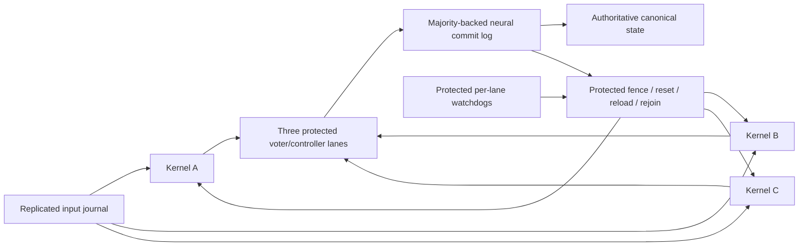

# Stage D: mask stalled tick replicas, then restore redundancy

This is a specification and reliability model, not a netlist implementation or a
Stage D pass. Replicate the **whole resident tick kernel three times per logical
control-node service**, vote complete canonical states, commit through a protected
replicated neural log, and repair a stalled replica from that log. Voting alone
leaves failed replicas unavailable: at the observed stall rate, unrepaired TMR
still has about **50% campaign failure probability** over 100 logical copies ×
1,000 ticks. With an assumed two-tick unavailability interval and successful
recovery, the independent-stall prediction is **0.2245%**. Recovery and protection
must be measured before either number can describe an implemented machine.

Sources are [the plan](plan.md), [Stage D harness](stage_d.md), the
[performance ledger](perf_campaign.md), and the updated
[datapath](stage_d_datapath_stall.md), [request](stage_d_request_stall.md), and
[completion](stage_d_completion_stall.md) stall reports. `docs/stable_latch.md`
is **absent in this checkout**. The task's statement that a latch-level cure was
shown impossible under independent per-neuron noise is a supplied premise, not
a proof independently inspected here. The available reports already rule out
treating a stronger clear or a timed READY as a generally qualified cure.
The campaign combining `zero_once`, `robust_request_clear`, and
`experimental_register_reset` is running per the task; its result is unknown.
The model uses the historical hazard, not an assumed improvement from those flags.

## 1. What the plan requires, and what runs on the host

The exact Stage D wording in `docs/plan.md` is:

> `minidoom` `p_*` on control nodes with TMR + commit log.
>
> Exit: 1,000 ticks of scripted and fresh random input, canonical state equal to the
> reference every tick; a retried commit is applied once.

The plan does **not** put “100 copies, mix B, zero faults/timeouts” in that sentence.
Those are the current noisy qualification campaign and the stricter scoring rules
in `docs/stage_d.md`. Nor does a `tick2.c` pass demonstrate `minidoom p_*`: the
current program has only three 8-bit architectural words. Its nominal 1,000-tick
pass in the ledger supersedes the older “not run yet” header in `stage_d.md`.

The plan's opening host inventory permits only neuron integration, spike
transport, input transduction, **initial** program-image loading, and display of
already-computed pixels. Game arithmetic, collision, branches, state evolution,
and rasterization remain neural. The reference and IR interpreter are test-only
observers, never a source of replacement runtime state.

There is also an explicit staged exception: Python control plane in Stages C–F,
labeled **hybrid**; F2 replaces readiness, dispatch, commit decision and
application recovery with neural control. That permits an identified temporary
hybrid orchestration implementation; it does not expand permission to compute
the game on the host. A Python decoded-state voter, Python commit log, host
timeout/restart decision, or host-computed checkpoint-to-spike loader would be
such external orchestration. Each exceeds the literal five-operation inventory,
must be disclosed, and cannot be presented as a neural protected voter or a
transport-only host. **This design chooses neural vote, watchdog, log, apply,
and recovery**, avoiding that exception for these decisions. It does not claim
F2 for the rest of the existing runtime.

FlyLink must remain a conduit:

| Field/action | Runtime origin in the plan and this design |
|---|---|
| Physical source neuron ID, simulator timestamp, physical route | External transport |
| Destination/multicast group, port, epoch, sequence, flags, payload | Neural sender's port codec, represented by tokens |
| Transport checksum | External transport; packet corruption only |
| Logical request ID, tick, comparison, quorum, timeout, retransmit, checkpoint selection | Neural circuits |

The host may deliver a checkpoint's already-generated rail events using a fixed
mapping. It may not decode a majority, synthesize those rails from Python game
objects, generate logical ACK/epoch fields, or set membrane/current/latch arrays
to recover a replica. `cluster/flylink.py` currently transports address events
over a fixed mapping. [Stage C](stage_c_flylink.md) demonstrates an alternating-bit
channel, but full epochs, reordering/corruption recovery, and the final field
codec remain work. A transport checksum does not detect a neural wrong value.

## 2. Replication and the commit boundary

One logical service (all decision and storage boxes are neural):



### Replicate a complete failure domain

Each logical service has lanes A/B/C, each containing the tick datapath, feedback
state, request/clear/completion machinery, local input storage, and local output
assembly. Use independent static weight/threshold/bias draws and independent stray
streams, and diverse placements as the plan requires. Do not fan out one sampled
noise mask or share mutable rails/reset circuitry among the three lanes. Shared
read-only topology in the simulator does not imply shared neuronal state.

This is **not per-cell voting**. A cell-level join that waits for all three can
still deadlock; a voter at every cell adds another reset/completion failure path
at every boundary and cannot recover distributed partial transactions by itself.
Whole-kernel replication confines those failures behind one transactional fence.
Three regions within a simulated node suffice for an initial independent-noise
experiment, but not for Stage F node-kill tolerance. For F, place lanes and log
members across distinct kill domains; one GPU/process hosting all three is one
common failure domain. “100 copies” in the proposed campaign means **100 TMR
services, hence 300 kernel lanes**, plus protection circuits, not 100/3 services.

### Vote a complete, tagged candidate state

For `stage-d-canonical-v1`, the canonical payload is exactly `px, mx, health`,
three unsigned bytes, in that order, no padding. Preserve the defined widths,
endianness, and overflow semantics. For `minidoom`, extend the architectural
schema to all persistent objects, registers, RNG state and continuation state;
renderers consume only a committed version.

The first implementation allows **one outstanding logical tick**. A replicated
neural input journal captures a transduced input once, assigns `(run_epoch,
stream, tick)` and retains it through commit. Dispatch gives all eligible lanes
the same input and the same committed predecessor. A lane emits a proposal only
after all canonical fields have a fresh, valid, exclusive dual-rail word for
that tick. Its ordinary cell “commit pulse” is not that certificate: the
completion report shows commands followed by no completed master rewrite.

Each voter lane buffers three proposals and compares **all state words and
their identity fields**. Compare A/B, A/C, B/C; authorize a pair only if the
same pair agrees on the entire vector, input identity, epoch, tick, and schema.
Choose a deterministic agreeing pair (e.g. AB, then AC, then BC) and copy its
buffered vector. Do not construct a state by choosing different pairs for
different words: that could create a state no two executions produced. A hash
alone is not an exact comparison. Silence, a partial word, both rails, wrong
generation, or a mismatched tick is ineligible, never a zero or an implicit vote.

Two agreeing complete proposals may commit immediately; the missing third need
not reach its deadline. A missing or disagreeing third is contained. With no
agreeing pair, **stop committing** and report a bounded service failure; never
pick the fastest lane, interpolate state, or ask the reference to supply it.
The two good lanes continue only from the voted predecessor. Initially this
means a neural input/feedback barrier after commit; the current unpaced,
overlapping tick pipeline must not be wrapped without that barrier. A later
pipelined version needs per-tick speculative buffers and an explicit rollback
contract and a new hazard/latency measurement.

### Protected voter and majority-backed log

Use three independently placed voter/controller/log lanes. Each has its own
receive buffers, exact comparators, protocol state, and storage. Consumers accept
only a same-identity, same-payload certificate from two controller lanes. Keep
the final certificate qualifier, fencing, epoch checks and log readers inside
the declared **protected** boundary. Replicating a voter does not remove the
final selection/qualification problem. Its residual failure rate, including
shared inputs, fan-out and controller faults, is a model parameter, not zero by
construction. An unprotected Python `majority()` is not its implementation.

Use a static single writer initially; no gratuitous leader election is needed
for this experiment. Every log member checks the previous committed index,
request identity and payload, writes a complete inactive record, then emits a
neural durable-within-the-declared-crash-model ACK. A commit certificate requires
two matching stored records. Publish `(state, last_applied_tick, request_id)` as
one versioned architectural record; readers qualify the whole version, never
partially updated words. Keep the previous bank live until the new record has
a certificate. The replicated last-applied record is the application marker,
so no crash window can advance a tick counter separately from its state.

“Apply” is installing that voted state version, not invoking the world update
again. A repeated `(epoch, stream, tick)` with identical payload returns the
existing ACK/certificate; it does not advance `last_applied`, update health,
consume input, or emit another logical state notification. Same identity with a
different payload is a conflict and fail-stop. Old identities are rejected by
the persisted watermark even after log compaction. A future tick cannot jump
a gap. Keep the current request's full payload until its retry window closes;
ancient retries get an already-applied/stale response, not a new append.

Two alternating committed-state banks plus the in-flight entry suffice for the
serialized toy kernel, provided compaction retains request identity, applied
watermark, and quorum evidence. This is a checkpointed bounded commit log, not
an unbounded audit history. Retaining 1,000 complete entries neurally has a
separate linear capacity cost. An observer may archive them for testing, but
that archive is not authoritative runtime storage. On controller/node restart,
neural peer agreement chooses the highest certified committed prefix, reconciles
an interrupted append, and fences obsolete writers before accepting new work.
“Raft-shaped” in the plan is not a substitute for proving these rules. If a
static writer dies, bounded fail-stop is sufficient for the first D prototype;
F requires protected replacement-writer selection as well.

## 3. Neural stall detection, masking, and recovery

Arm a per-lane timer on accepted `START(epoch,tick)`, outside that lane's reset
domain. Cancel it only on the matching complete proposal/commit participation
certificate, not a heartbeat, a rail train, or activity on a previous tick.
Use three independently protected timer channels per lane and a two-of-three
timeout authorization. Timer cancellation and reset must be tagged and finish
before reuse. A delayed t ACK must not cancel t+1's watch. A false timeout is a
lane outage; correlated or unsafe fencing is a protection failure.

Choose a bound from a measured worst-case valid response over the declared
input/noise/link envelope, including boot latency, backpressure and retries.
The current host `--stall-ticks` diagnostic is not a neural watchdog contract.
For budgeting only, a 4,000-hop existing-style timer is about **21.2 neural s**
(5.3 ms/hop). This exceeds the nominal 12.1-s first full-state result, but is
**not a qualified worst-case deadline**. Distinguish a replica deadline from the
service deadline: timely two-lane commits remain successful while one timer
expires. State buffers must retain valid words throughout the longest allowed
vote/retry/repair interval; qualify retention, do not assume it is infinite.

The kernel watch covers a lane's complete local tick proposal. A separate
protected append/apply watch covers the service's authoritative commit: receiving
three proposals must not hide a stalled log or publication path. Likewise, arm
a recovery deadline outside the failed lane. These shorter controller timers
and their failure terms belong to the protected control budget below.

The recovery state machine is:

1. **Fence.** On a protected timeout or invalid/disagreeing proposal, revoke that
   lane's vote/output/input credits and advance its neural incarnation token.
   Ignore any delayed proposal from the old incarnation. Fencing precedes reset.
2. **Quiesce.** Inhibit START, COPY, feedback and port emission. Drain delayed
   events under the model's ≤10-ms synaptic-delay bound plus measured relay and
   synaptic-current settling. Interrupting a cell alone is insufficient: its
   producers, repair chains or delayed re-lights can revive it.
3. **Reset the replica.** Use a dedicated neural reset sequencer over the full
   transient domain: Q and M rails, validity/completion trees, ALU state, request
   pairs, IDLE/ACT/COMMIT/grant/COPY, pending port words, flag generators and rate
   readers. Check both latch members and all extended reset targets. Suppress
   all producers until reset, recovery and load finish. Do not equate a timed
   READY with actual emptiness. A quiet interval is evidence under a qualified
   envelope, not proof for arbitrary noise or residual hyperpolarization.
4. **Choose an architectural boundary.** The two healthy lanes may run while
   reset proceeds. At a certified committed tick k, hold dispatch at a neural
   barrier and pin state C[k] until reload completes. For a simpler first
   prototype, hold this barrier throughout repair. If the lane fell behind by
   many ticks, choose the latest certified checkpoint; do not chase a moving
   state by replaying world updates. The input journal retains the next input.
5. **Reload neurally.** The log's dual-rail storage drives a selected-rail copy
   path through the lane's validated write ports into architectural feedback
   masters. Every bit emits rail 0 or rail 1 explicitly. A neural sequencer
   restores addresses/words, tick and last-applied identity, the safe continuation
   (“before START k+1”), and defined flags/control readiness. Transient scratch
   is empty or initialized before read; constants cleared by quiescence are
   reloaded from the neural ROM/image already installed at startup. No host
   decoding, `load_pipeline_image` call with a Python state dict, direct state
   array write, or saved membrane snapshot is involved.
6. **Verify and rejoin.** Wait for fresh completion and actual ready interlocks,
   read back the canonical state/continuation through neural comparators against
   the pinned checkpoint, and require a protected same-version join certificate.
   Release the dispatch barrier for k+1. The existing kernel's Q READY is not
   consumed by IDLE; that interlock must be added before a reset retry is safe.
   A partial load, survivor, timeout, wrong tag or bad readback leaves the lane
   fenced; it must never vote just because a timer elapsed.

Bound the attempts and total recovery deadline. Exhaustion leaves a permanently
unavailable lane and is reported separately; it is not a successful repair.
A qualified cold spare could replace it, but needs additional capacity and its
own neural load/join path. Two unavailable lanes stop commits. A policy that
tries to recover after losing the majority would need an additional recovery
deadline/state model; the quantitative model below conservatively counts that
event as an exit failure immediately.

The existing reset-verification prototype is **not** a drop-in recovery path:
the completion report records exhaustion, a combined-domain failure before
reset, and a Q retry clearing an already-started next transaction. Likewise
`experimental_register_reset` has known full-domain failures. TMR changes their
system consequence only if fencing and recovery really restore redundancy.
It cannot make a permanently bad lane healthy by definition. Static perturbations
remain the same after reset; resetting is not a fresh noise draw.

For Stage F, recovery starts with surviving neural log/checkpoint replicas;
the host may launch/integrate a replacement image, but its architectural state
arrives from neural peers. Committed ticks are restored as state records, never
re-evaluated by F. An uncommitted tick may be recomputed from C[k] and the retained
input after fencing its old proposals. TMR already evaluates F redundantly;
“no repeated world update” means no repeated **authoritative application** of a
committed tick. Drop an ACK after apply, restart, and retry: application remains
once. Simulator snapshots of voltages/currents/delay queues serve debugging/HPC
resume only and do not establish this recovery claim. Loss of every log majority
stops the service; live recurrent storage is not nonvolatile persistence across
loss of all neural nodes.

## 4. Quantitative reliability model

Implementation: [tmr_model.py](../drosophilos/bench/tmr_model.py), pure Python/NumPy.
It neither imports game code nor controls the simulator. `Model`, `analytic`,
`monte_carlo`, `binned_hazard`, and `unreplicated_failure` are usable directly.

### Evidence and temporal distribution

Use h = 5×10⁻⁵ per active replica per tick, with 4–6×10⁻⁵ as a sensitivity range,
from roughly 4–6 stalled copies per 100 over 1,000 ticks. This range is not a
confidence interval. Treat each observation as a right-censored first-stall
mission. The specifically documented head-to-head runs give:

| Build | Completed ticks before first stalled attempt | Fully matched copies |
|---|---|---:|
| Default | 1, 31, 323, 728 | 96/100 |
| `rate_robust` | 450, 535, 599, 654, 864 | 95/100 |

The numbers are completed-tick counts: a stop after one completed tick is model
index 1, the second attempted tick. There are both early and late events; a
startup burn-in cannot establish long-run liveness. Total attempted exposure is
97,083 + 4 + 98,102 + 5 = **195,194 replica-ticks**, giving 9/195,194 ≈ 4.61×10⁻⁵.
The ledger also reports a batch fault in each run; “zero wrong” does not mean
“zero detected internal faults.” The older nine-stall build is not pooled here.

The timing sensitivity pools the nine events into four bins. Pooling two builds
with the same seed is illustrative, not nine independent measurements of one
fixed circuit. Bin rates are first stalls divided by at-risk attempted ticks:

| Zero-based attempt indices | Events | Exposure | Raw h | h normalized to the constant model's mission survival |
|---|---:|---:|---:|---:|
| 0–249 | 2 | 49,534 | 4.03763e-5 | 4.38163e-5 |
| 250–499 | 2 | 49,275 | 4.05885e-5 | 4.40466e-5 |
| 500–749 | 4 | 48,520 | 8.24402e-5 | 8.94638e-5 |
| 750–999 | 1 | 47,865 | 2.08921e-5 | 2.26721e-5 |

Normalization rescales `-log(1-h[t])` so its sum equals
`-1000 log(1-5e-5)`. Unrepaired mission failure is therefore identical for the
constant and normalized profiles; overlapping recovery risk need not be.
Do not force all future stalls onto these nine exact indices or replay the
same noise draw in all three lanes. More independent seeds, newly compiled
placements, and recurrent-repair histories are needed to estimate a hazard.

### Definitions and exact calculation

T = 1,000 logical ticks; C = 100 independent logical services. A healthy lane
stalls with Bernoulli probability h[t]. Healthy outputs are assumed correct;
detected invalid outputs can be included in h. Two concurrent unavailable lanes
fail the service. Failure is absorbing even if both could later be repaired.

R is the total number of service-tick opportunities during which a stalled lane
cannot vote, **including the failing tick**. A stall at t returns before t+R.
Thus R=1 cannot save two stalls in the same tick; R=2 also exposes the next tick.
Convert a neural-time budget conservatively as
`R = max(1, ceil((detection + reset + load + verify + join) / healthy_tick_period))`.
Use a measured effective hazard while healthy lanes are holding at a barrier:
strays continue during pauses. The model counts exposure opportunities, not wall
time, and does not independently model hold-time faults or HPC time limits.

Let p = 1 − product(1−h[t]). Without replication/recovery:

```
P(single mission fails) = p
P(any of C missions fails) = 1 − (1−p)^C
```

For three replicas without recovery:

```
P(one service loses majority) = 3p²(1−p) + p³ = 3p² − 2p³
P(campaign fails) = 1 − (1 − P(service fails))^C
```

For finite R, the analytic solver retains probability mass in: H (all healthy),
D[k] (one unavailable for k more ticks), P (one permanently unavailable), and
F (failed). At each tick:

* H → no stall: `(1−h)^3`; H → one stall: `3h(1−h)^2`;
  H → F: `3h²−2h³`.
* Any degraded state survives that tick with `(1−h)^2`; another lane stalls
  with `2h−h²`, entering F. Decrement its recovery countdown after this exposure.
* On repair completion return to H with probability `1−f_repair`, otherwise P.
  R=None never repairs. R≥T cannot improve the in-mission outcome.

The finite horizon includes startup and tail effects. Remaining in a degraded
state **after successfully committing the final requested tick** is not an exit
failure in this model. Report and drain that repair separately in experiments.
For small h and constant R≤T, a useful check is:

```
P(service failure) ≈ 3 Σ h[t]²
                    + 6 Σ_t h[t] Σ_{u=t+1}^{min(t+R−1,T−1)} h[u]
                 ≈ (6R−3) T h²              [constant h, T much larger than R]
```

Unlike merely cubing a per-tick availability, this counts overlaps with a
replica that stalled earlier. Unlike permanent TMR, it allows repeated repairs.

`voter_failure` v[t] includes residual fatal voter/commit-controller/log failure;
`watchdog_failure` w[t] includes residual fatal detection/fencing failure.
These are **per-service per-tick rates after protection and demand weighting**,
not raw component rates. A timer's per-demand miss probability must be multiplied
by its demand rate and evaluated for whether it actually defeats the service
deadline; do not insert it unconverted. Safe false exclusions belong in lane
unavailability. `common_mode` c[t] is a shock defeating at least two lanes of
one service. Surviving service mass is multiplied by `(1−v)(1−w)(1−c)` each tick.
`global_common_mode` g[t] represents a shock shared by all C services:

```
P(exit failure) = 1 − S_service^C × product_t(1−g[t])
```

The last factor is applied once per campaign, not raised to C. All these
independent-factor assumptions are explicit; overlapping categories must not
double-count a mechanism. `recovery_failure` is conditional on a repair attempt
and leaves that lane down for the mission. Duration variability, latent static
frailty and repeated failures immediately after rejoin are not fitted by this
model. Use a worst-case R and a nonzero failure fraction until measured.
An unsafe reload that is wrongly certified for rejoin is a protection failure,
not the safe, fenced `recovery_failure` outcome.

### Results: predicted probabilities, not neural campaign results

Constant hazard, successful bounded repair, perfect protection, no common mode:

| Configuration | h=4e-5 | h=5e-5 | h=6e-5 |
|---|---:|---:|---:|
| No TMR, no repair | 98.1686% | 99.3263% | 99.7522% |
| TMR, no repair | 36.2507% | 49.9825% | 62.5731% |
| TMR, R=1 | 0.0480% | 0.0750% | 0.1079% |
| TMR, R=2 | 0.1438% | 0.2245% | 0.3232% |
| TMR, R=5 | 0.4298% | 0.6707% | 0.9642% |
| TMR, R=10 | 0.9023% | 1.4057% | 2.0172% |
| TMR, R=20 | 1.8311% | 2.8443% | 4.0669% |
| TMR, R=100 | 8.5533% | 12.9939% | 18.1021% |

At h=5e-5, unrepaired per-service failure is 0.00690403, repaired R=2 is
2.24793e-5. The normalized observed timing profile increases campaign failure
to **0.27775% (R=2)**, **1.73193% (R=10)**, and **15.3966% (R=100)**. Its bins
are too sparsely populated to demonstrate a true hazard peak, but timing matters.

Sensitivity at h=5e-5, R=2, with other additional terms zero:

| Additional assumption | Campaign failure |
|---|---:|
| v=w=1e-10 per service-tick | 0.22654% |
| v=w=1e-8 | 0.42389% |
| v=w=1e-6 | 18.3108% |
| c=1e-8 per service-tick | 0.32427% |
| c=1e-6 | 9.71944% |
| g=1e-8 per campaign-tick | 0.22554% |
| g=1e-6 | 0.32427% |
| 1% of repairs leave the lane permanently down | 0.94306% |
| 10% of repairs leave it down | 7.15335% |
| All repairs fail | 49.9825% |

These protection and recovery rates are hypothetical sensitivity inputs. The
current evidence does not measure any of them. At low rates a target campaign
failure budget ε permits roughly
`P_service_stalls + T(v+w+c) + T g/C < ε/C`.
For example, R=2 cannot promise 99.9% campaign success even with perfect
protection. Nor does its roughly 2.25e-8 service-tick overlap risk meet the plan's
**1e-10 per protected operation objective**. Even R=1's same-tick term is 7.5e-9;
getting it below 1e-10 would require h≲5.77e-6 before accounting for protection.
Passing one observed campaign is not a measurement of that objective.

Monte Carlo independently samples replica first-event times from the discrete
Bernoulli survival CDF, renews repaired lanes, tests unavailable-interval overlap,
and samples protection/global shocks. It simulates **whole campaigns**, with
NumPy seed 108, 20,000 campaigns (2,000,000 logical services) per row:

| Recovery | Failed campaigns | MC estimate | 95% Wilson interval | Analytic |
|---|---:|---:|---:|---:|
| None | 9,943 | 49.715% | 49.0222–50.4079% | 49.9825% |
| R=1 | 16 | 0.080% | 0.0493–0.1299% | 0.0750% |
| R=2 | 49 | 0.245% | 0.1854–0.3237% | 0.2245% |
| R=10 | 288 | 1.440% | 1.2840–1.6147% | 1.4057% |

These samples use the default batch size of 1,000 campaigns. The Monte Carlo
record includes it: changing the batch size changes the seeded draw order,
while preserving the modeled distribution.

Run each row with `--recovery-ticks none|1|2|10`:

```sh
uv run python -m drosophilos.bench.tmr_model --recovery-ticks 2 --trials 20000 --seed 108
uv run python -m drosophilos.bench.tmr_model --profile observed --recovery-ticks 2 --trials 20000
uv run python -m drosophilos.bench.tmr_model --recovery-ticks 2 --voter-failure 1e-8 --watchdog-failure 1e-8 --trials 0
```

Independent noise draws do not give independence from shared compiler defects,
identical timing/reset design, an input-sensitive corner, shared log/input buffer
failure, shared power/process/GPU death, or transport/simulator bugs. The request
report's susceptible-latch census also suggests static frailty: a repaired lane
keeps its susceptible parameters. Compare conditional repeat-stall rates after
reload against first-stall rates. Common-mode injection, diverse placements and
fresh inputs are mandatory. Zero wrong values in the historical full-kernel
campaign does not prove every primitive fault is fail-stop: the reduced master
experiment even observed double-railed completions. The protection boundary must
validate words and avoid exporting that latent fault as a certificate.

## 5. Neuron, synapse and latency budget

These are Profile 3 planning estimates, using existing measured contracts and
structural counts, **not costs of a constructed TMR netlist**. “Synapses” here
means logical edges (`nnz`), not summed quanta/anatomical contacts. Relevant anchors:

| Primitive or path | Neurons / edges | Measured or documented neural timing |
|---|---:|---|
| Recorded generic tick2, canonical outputs | 29,375 / 52,808 | First whole state 12.1 s; unpaced steady mean 5.84 s |
| Rate-robust version | 30,643 / 55,936 | No Stage D liveness gain established |
| Four-bit transport channel contract | 201 / 395 | 155.5-ms mean ACCEPT, 186.8-ms noisy max in retained campaign; 333.5-ms nominal cycle |
| Four-bit staged register contract | 336 / 659 | ~247 ms grant→master complete; 531.5-ms mean full cycle |
| Latched two-input AND/OR, base builder | 6 / 10 | Gate integration tens of ms; budget 30–60 ms/level from H0 |
| Validated B-bit register, current base builder | 17B+16 / 36B+13 | Width/depth-dependent; READY alone ≈84.8 ms nominal |
| H-hop watchdog, one start/cancel source | H+6 / 2H+14 | ≈5.3H ms, plus entry/output overhead |
| Experimental reset verifier, per register | +104 / +(D+152+F) | Common ≈140–147 ms, retries ≈306–493 ms; exhaustion 716.1 ms |

Register/gate/watchdog counts were checked read-only with the current builders:
validated widths 4/8/24/72 cost 84/152/424/1,240 neurons and
157/301/877/2,605 edges. A current standalone staged 4-bit build is 336/661
(two more edges than the historical contract); the 8-bit build is 528/1,081.
Do not silently substitute historical counts for a new build. The reset-verifier
figures are from the completion report: D is final reset fan-out and F indicates
an existing FAULT target. That rejected prototype supplies a budgeting anchor,
not a qualified reset implementation.

For a conservative explicit toy budget, use a 72-bit comparison record:
24 state + 16 tick + 16 run epoch + 8 input + 8 format/type. Stream/source is a
fixed port assignment; local incarnation checking needs additional metadata.
Sixteen-bit counters cover this mission, but rollover requires drain/fencing or
a larger declared width, never silent wrap. With one outstanding tick, its
predecessor is determined by the committed index. Larger architectural state
increases these counts linearly, with comparison depth growing logarithmically.

One equality comparator between two B-bit dual-rail words uses two latched ANDs
and one OR per bit, then B−1 latched ANDs over equal bits: **24B−6 neurons**,
**40B−10 edges** before reset. Resetting the gate and two latch members adds
12B−3 edges. Three pair comparators per voter therefore cost 72B−18 neurons,
156B−39 edges, excluding shared control, qualifiers and reset sequencers.
This is a cost construction, not a claim that rate-mode comparators tolerate
fast single rails; conditioning/true-rail qualification remains required.

| Allocated block for one logical TMR service | Neurons | Edges |
|---|---:|---:|
| Three generic kernels | 88,125 | 158,424 |
| Three proposal buffers × three voter lanes, each 72 bits | 11,160 | 23,445 |
| Three pair comparators × three voter lanes, 72-bit records, basic reset fan-out | 15,498 | 33,579 |
| One voted-record buffer per controller | 3,720 | 7,815 |
| Two committed-log banks per controller | 7,440 | 15,630 |
| One 40-bit input/identity journal per controller | 2,088 | 4,359 |
| Provisional 48-bit controller metadata register per controller | 2,496 | 5,223 |
| Three watchdog channels per kernel lane, H=4,000 | 36,054 | 72,126 |
| Subtotal before recovery sequencers/glue | **166,581** | **320,601** |

The existing 14 Q/M pairs per kernel suggest 28 reset-domain verifiers. Applying
the prototype's count only as an allowance gives 3×28×104 = **8,736 neurons**
and `ΣD + 12,768 + ΣF` edges across all lanes. D must be enumerated after all
reset extensions; fan-out is not free. A further isolation fan-out can cost up
to about 3×29,375 = **88,125 edges** if every kernel neuron needs a fence input.
Reserve **5–10k neurons / 15–30k edges** for reset sequencing, selected-rail
load/copy, identity/conflict checks, timer majority/cancellation, output
qualification, epoch ports and static-writer control. This produces an order
**180–190k neurons and roughly 450–520k edges** if ΣD is 20–60k. That range is
a provisional allocation, not a bound; extra conditioning and wider metadata
can exceed it. Full log history, cold spares and F leader replacement are excluded.
Archiving 1,000 additional 72-bit validated records on three log members alone
adds roughly 3.72M neurons / 7.815M edges, before indexing/control.

The naive protected design already exceeds one 166,700-neuron MCNS image before
placement/relay costs. Distribute it or reduce the architecture with measured
sharing; do not call it a single-node Profile 2 fit. A shared timer oscillator
could save much of the 36k timer allocation but becomes a new common dependency
and is an unmeasured design change. The capacity report must precede any >4-node
scale-up. For 100 logical services, mutable neuron state is roughly 18–19M
neurons at this budget, despite shared topology; wall time is not inferred by
multiplying the old 100-copy run by three.

Normal-path latency budget after the second complete proposal:

* Buffer/validate ~0.15–0.25 s, extrapolating the channel contract.
* Equality uses two bit-comparison levels plus ceil(log2 72)=7 reduction levels:
  ~0.27–0.54 s at 30–60 ms/level; pairs/voter lanes operate concurrently.
* Log stage/copy/publication ~0.35–0.60 s plus transport. Stage C's measured
  demonstration used 20-ms modeled link delay; allow at least an append/ACK
  round trip (~40 ms at that setting), not a zero-cost host call.

Allow roughly **0.8–1.5 neural s per committed tick** for the protection path,
subject to measurement of wider completion, reset/rearm and retained-data load.
Healthy-lane watchdogs cancel concurrently and add no 21.2-s serial wait.
The initial one-outstanding-tick barrier also sacrifices the existing pipeline's
overlap: using 12.1 s as a first estimate for a serialized kernel gives
**12.9–13.6 s/tick**, about 2.2–2.3× the old 5.84-s interval. This is an estimate,
not a measured repeated serialized schedule. Concurrent replication does not
triple neural latency. Later buffering could preserve overlap, but needs a new
capacity, correctness, and timing analysis. The 35-Hz game tick is logical, not
demonstrated real-time execution.

A recovery budgeting target is **1–3 s after detection** for quiescence, bounded
reset attempts, parallel architectural writes, readback and rejoin, informed by
the ~0.14–0.72-s reset and ~0.25-s staged-copy anchors. It is not demonstrated
for a 29k-neuron domain. Add the proposed 21.2-s detection bound: total ≈22–25 s.
That is approximately R=2 at a ~13-s serialized cadence, or R=4–5 at the old
5.84-s cadence. If full architecture/transport or reset retries exceed it, use
the measured larger R. The completion report's +65.6 ms READY delay for the
experimental reset is not a whole-kernel recovery time. Barrier pause/hold
hazards and neural/wall-time run ceilings must be included in the real campaign.

## 6. Staged implementation and acceptance gates

| Step | Work | Acceptance before proceeding |
|---|---|---|
| 0: model and protocol spec | This document/model; freeze canonical record, identity, fencing and reset/load interfaces | Model agrees with binomial closed forms and exhaustive short missions; Monte Carlo agrees within sampling uncertainty; validate endpoints, censoring and repair off-by-one behavior. No neural reliability claim. |
| 1: transactional output fence | One tick outstanding, neural input journal and complete tagged-state assembly | Exact canonical fields under scripted/fresh input; skew/reorder field completions; no mixed tick, no partial publish; reference observer cannot influence runtime. |
| 2: protected comparator/voter | Three complete kernel lanes, triplicated buffers/comparators, same-pair whole-vector certificate | Exhaustive small words including absent/double rails; stale epochs/incarnations; one differing lane; two agreeing lanes with a silent third; AB agreeing on one word and BC on another must not create a false vector quorum. Inject each voter-lane failure and a common-mode failure. Measure protection overhead. |
| 3: neural commit log | Quorum append, two-bank publication, persistent request identity/applied watermark, bounded compaction | Duplicate before append, after append, after certificate, after publication but before ACK, and after reload/compaction: one logical application/notification. Conflicting identity refuses. Kill one log lane at every boundary; no torn state/index. Kill majority: no commit. Small controller FSM exhaustive crash-prefix check. |
| 4: neural watchdog/fencing | Tagged START/cancel, replicated timer decisions, lane exclusion | No false timeout within the measured healthy envelope; terminal lane detects within B; old ACK cannot cancel next watch; one fast/stuck timer cannot reset a healthy lane; surviving two commit every requested tick. Separate internal versus service timeout counters. |
| 5: reset/load/rejoin | Full-domain quiescence, verified reload, Q READY/IDLE interlock | Force each measured request/Q/M stall; both old members/late events contained; same-rail and changed-rail reload; compare all architecture to C[k]. Recovery completes within declared R or exhausts while fenced. Stall again after rejoin under the SAME static draws. Deliberate corruption, premature READY and partial reload never rejoin. Measure f_repair and conditional repeat hazard. |
| 6: integrated toy qualification | 100 logical TMR services, all 300 lanes independently perturbed, retained observers | 1,000 ticks with exact canonical comparison each tick and exactly-once log retry. Independent seeds and opt-in flags recorded; inject one stall, overlapping two stalls, late duplicates and lost ACKs. Report recovered events, repair latency tails, exhaustion, protection faults, duplicates/wrong/missing and truncation separately. Do not infer success from the analytic prediction. |
| 7: actual Stage D and F boundary | Run explicitly named minidoom p_* program/architectural schema; extend checkpoint/continuation coverage | Meet the plan's quoted D exit including commit-log replay. Then F kills physical nodes at safe and unsafe points, restores via surviving neural checkpoints, and proves no repeated committed world update. Label remaining Python orchestration and compiler/placement modes; F2 has its own exit. |

For the **TMR-aware noisy exit**, score the authoritative committed stream of
each of the 100 services: all 1,000 canonical states match the reference; one
application per identity; no wrong, invalid, missing or extra logical state;
no unmasked service fault/timeout or resource truncation. Masked lane stalls,
detected invalid proposals, watchdog expirations and successful recoveries have
nonzero, explicit counters and bounded latency. In addition, drain/report any
repair pending after tick 1,000; do not silently count a permanently degraded
service as “recovered.” Aggregate fault counters from the old harness cannot
distinguish these categories and must be extended before this can be scored.

This is a **new explicitly labeled TMR service qualification**, not a retroactive
pass under `stage_d.md`'s current zero-run-level-fault/timeout rule. Under that
unchanged rule a masked fault still fails the old harness. Preserve its verdict
and report both scopes; do not erase replica failures to obtain zeros. The plan's
Stage D exit is met only when the actual `minidoom p_*` neural implementation
with TMR and the commit log satisfies the quoted per-tick and retry conditions.
A toy tick pass, host voting demo, probabilistic estimate or simulator snapshot
restart alone cannot establish it.

## 7. Validation of this design artifact

All **48 tests** in `tests/test_tmr_model.py` pass using the existing environment
and a writable task-local uv cache. They check closed forms, exhaustive small missions, repeated
repair, permanent repair failure, nonstationary hazards, common-mode scope,
Monte Carlo agreement, numerical stability, empirical censoring, and CLI/errors.
The exact requested command was attempted:

```sh
TMPDIR=/private/tmp/claude-501/tmpdir uv run pytest -q tests/test_tmr_model.py
```

It was blocked opening `~/.cache/uv/sdists-v9/.git` by the sandbox. The successful
equivalent sets `UV_CACHE_DIR` to the task's writable `tmp/uv-cache`,
`UV_PROJECT_ENVIRONMENT` to the existing repository `.venv`, `UV_NO_SYNC=1`,
`PYTHONPATH=.`, and `PYTHONDONTWRITEBYTECODE=1`, retains the requested `TMPDIR`,
and adds `-p no:cacheprovider --basetemp=<task-tmp>/pytest`. No netlist code was
changed. Integration and commits belong to the orchestrator; none was attempted.
